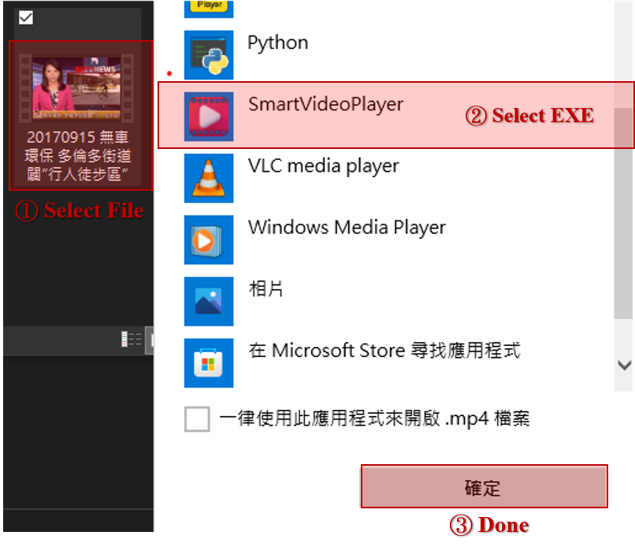

<p align="center">
  
  <em size="10" color="#5555cc" face="serif">SmartVideoPlayer</em><br>
</p>

# SmartVideoPlayer

You can use easy way gesture action to remote control video player. In other ways, the video will be automatically paused when you leave, and will continue to play when you come back. 

Example scripts for the detection using the [Mediapipe](https://github.com/google/mediapipe), and part of the picture display in the UI is taken from [Font Awesome](https://fontawesome.com).

## ➤ Contents
1) [Requirements](#Requirements)

2) [Action-Recognition](#Action-Recognition)

3) [Windows](#Windows)

<p align="center">
    
</p>
<p align="center">
    <a href="{https://www.youtube.com/watch?v=FwhnuyOf8ms&ab_channel=%E6%9F%8F%E5%B0%BCBunny}" title="Link Title">Reference Video URL</a>
</p>

## ➤ Requirements

* **OpenCV**, **PYQT5**, **python-vlc** and **youtube-dl**. 
* **VideoLAN :**

    Please download VideoLAN project Library [VLC media player](https://download.cnet.com/developer/videolan/i-6197208/).
* **Note :**

    The `requirements.txt` file should list all Python libraries that your notebooks
    depend on, and they will be installed using:

    ```
    pip install -r requirements.txt
    ```

## ➤ Action-Recognition
* Need camera to use smart control function.

* ***Gesture Action :***

    |  Reference | Icon | Action |     Describe      |
    |:-----------:|:-------:|:-------:|:---------------------------:|
    | [](temp/demo/) | [](assets/) | `Start` | Wait for `1s` to play `1x` speed video . |
    | [](temp/demo/) | [](assets/) | `Pause` | Wait for `1s` to pause video . |
    | [](temp/demo/) | [](assets/) | `Play SpeedUp` | 🖠gesture turn `right` 20° ~ 40° to play `2x` speed up and  > 40° play `4x` speed up . |
    | [](temp/demo/) | [](assets/) | `Play SpeedDown` | 🖠gesture turn `left` 20° ~ 40° to play `2x` speed down and  > 40° play `4x` speed down . |
    | [](temp/demo/) |  | `+/- Volume` | use thumb/index finger to control volume . |
    | None | [](assets/) | `Import File` | if you don't pre-set `SmartVideoPlayer.exe` for default startup method, please import file from here . |
    | None | [](assets/) | `Undo` | Undo init actions . |
    | None | [](assets/) | `SmartControl` | can use reference items to remote control actions . |

* ***Face Action :***

    |  Reference | Icon | Action |     Describe      |
    |:-----------:|:-------:|:-------:|:---------------------------:|
    [](assets/) | [](assets/) | `Start` | Wait for `2s` to play `1x` speed video . |
    | [](temp/demo/) | [](assets/) | `Pause` | Video will automatically pauses immediately . |


## ➤ Windows
* Open cmd and go to the SmartVideoPlayer directory :

        pyrcc5 -o resources.py resources.qrc

        python SmartVideoPlayer.py
        python SmartVideoPlayer.py [VIDEO_PATH]
        

* To open a video in this application :
    1) From the desktop, `right-click` the desired file .

    2) From the drop-down menu, click `Open with`, then select the `SmartVideoPlayer` application.

    3) The file will open in the selected application.

        


# [Demo]()
